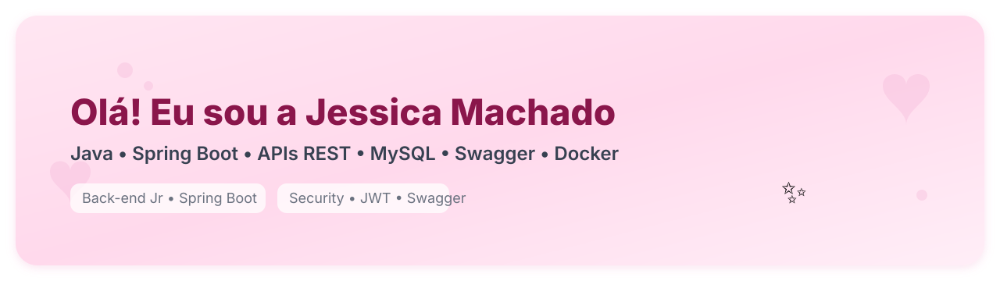

  

<h1 align="center">Oiê, eu sou a Jessica! ✨</h1>

  Back-end Jr em <b>Java + Spring Boot</b> | APIs REST | Segurança (JWT) | <b>MySQL + JPA/Flyway</b> | Swagger | Docker

  
  
  
  

---

### 🌷 Sobre mim
- 🎀 Dev que ama **código limpo, testável e bem documentado**  
- 🔐 Construindo **APIs REST seguras** com Spring Security + JWT  
- 🧪 Estudando **JUnit + MockMvc** e boas práticas de testes  
- 🐾 Mãe da Maria Cecília & Alfredo  💕  

---

### 🧁 Stack 
&nbsp;
&nbsp;
&nbsp;
&nbsp;

- Arquitetura: Controller → Service → Repository → DTOs/Entities  
- Migrações: **Flyway** • Documentação: **Swagger/OpenAPI** • Observabilidade: logs + métricas simples

---

### 🍰 Projetos em destaque
> Clique para ver o README, endpoints e prints do Swagger.

- 🔐 **[Forum Hub API](README-forum-hub.md)** — autenticação JWT, paginação, Flyway  
  `Java 21 · Spring Boot 3 · MySQL` → `forum-hub`  
- 🏥 **[VollMed API](README-vollmed-api.md)** — médicos, pacientes e consultas + Swagger  
  `Spring Security · Bean Validation` → `app-voll-med`  
- 💳 **[Financial Transactions API](README-financial-transactions.md)** — regras de negócio e validações  
  `DTOs · Exception Handler` → `dio-financial-transaction`  
- 📦 **[Orders API](README-orders-api.md)** — REST + testes de controller (MockMvc)  
  `TDDzinho de respeito` → `java-orders-rest`  
- 🧭 **[Tour Booking Microservices](README-tour-microservices.md)** — arquitetura de microserviços  
  `Gateway · services · Docker` → `tour-microservice

---

### 🌸 Como costumo trabalhar
- Issues pequenas e bem descritas ✅ • Commits claros (`feat:`, `fix:`, `test:`)  
- README com **conheça/rode/teste em 5 min** ⏱️  
- CI simples no GitHub Actions para build/test ✅

---

### 🍡 Estatísticas (because it’s cute)

  
  

---

### 📬 Vamos conversar?
**machadojessica1997@gmail.com** · Me chama no LinkedIn 💌

