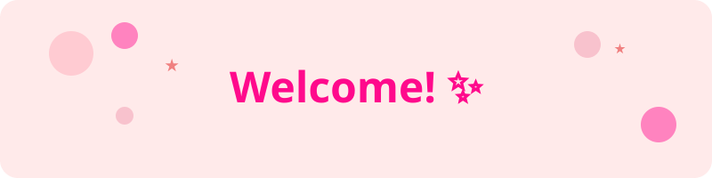

<p align="center">
  
</p>

<h1 align="center">Olá, eu sou a Jessica! ✨</h1>
<p align="center">
  <strong>Desenvolvedora Backend Java Jr</strong> | APIs REST Seguras | Spring Boot 3 | MySQL + JPA | Docker | Clean Code
</p>

<p align="center">
  <a href="https://www.linkedin.com/in/jessica-machado-franco-4aa149249">
    
  </a>
  
  
  
  
</p>

<p align="center">
  
  
  
</p>

---

## 🌷 Sobre mim

```java
public class Jessica extends Developer {
    private String[] specialties = {"Backend Java", "REST APIs", "Clean Code"};
    private String currentFocus = "Building secure and scalable APIs";
    private String[] learning = {"React 19", "Next.js 15", "Microservices"};
    private String[] pets = {"Maria Cecília 🐱", "Alfredo 🐶"};
    
    @Override
    public String getMotivation() {
        return "Transformando ideias em código limpo que resolve problemas reais! 💡";
    }
}
```

- 🎀 Dev que ama **código limpo, testável e bem documentado, com foco em Backend Java**  
- 🔐 **Apaixonada por APIs REST seguras** usando Spring Security + JWT  
- 🧪 **Estudante** de JUnit 5 + MockMvc para maior confiabilidade
- 📚 **Oracle ONE Graduate** com mais de 200 horas de desenvolvimento prático
- 🌱 **Evoluindo para Full-Stack** com React + Next.js
- 🐾 **Mãe orgulhosa** da Maria Cecília 🐶 e do Alfredo 🐶

---

## 🛠️ Tech Stack

### Backend Core (Forte)
<div align="left">
  &nbsp;&nbsp;
  &nbsp;&nbsp;
  &nbsp;&nbsp;
  &nbsp;&nbsp;
</div>

### DevOps & Tools
<div align="left">
  &nbsp;&nbsp;
  &nbsp;&nbsp;
  &nbsp;&nbsp;
  &nbsp;&nbsp;
</div>

### Frontend (Em desenvolvimento)
<div align="left">
  &nbsp;&nbsp;
  &nbsp;&nbsp;
  &nbsp;&nbsp;
  &nbsp;&nbsp;
  
</div>

### 🏗️ Arquitetura & Práticas

```java
🎯 Clean Architecture
Controller → Service → Repository → DTOs/Entities

🔐 Security & Authentication
Spring Security • JWT Tokens • BCrypt • CORS

🗄️ Database & Migrations  
MySQL/PostgreSQL • JPA/Hibernate • Flyway Migrations

📝 Documentation & Testing
Swagger/OpenAPI • JUnit 5 • MockMvc • Test Containers

🔍 Observability & Monitoring
Spring Actuator • Structured Logging • Health Checks
```

---

## 🍰 Projetos em Destaque
> **Clique para explorar:** README completo, endpoints documentados e exemplos do Swagger

<table>
<tr>
<td width="50%">

### 🔐 [Forum Hub API](README-forum-hub.md)
**Fórum com autenticação completa**
- ✅ **JWT Authentication & Authorization**
- ✅ **Paginação e filtros avançados**  
- ✅ **Flyway Migrations**
- ✅ **Swagger Documentation**

`Java 21 • Spring Boot 3 • Spring Security • MySQL`

</td>
<td width="50%">

### 🏥 [VollMed API](https://github.com/Jess-mach/vollmed-api)
**Sistema de gestão médica completo**
- ✅ **CRUD Médicos & Pacientes**
- ✅ **Agendamento de consultas**
- ✅ **Bean Validation avançado**
- ✅ **Exception Handler customizado**

`Spring Security • Bean Validation • MySQL • Swagger`

</td>
</tr>
<tr>
<td width="50%">

### 💳 [Financial Transactions API](https://github.com/Jess-mach/financial-transactions)
**API financeira com regras de negócio**
- ✅ **DTOs e mapeamento automático**
- ✅ **Business Rules complexas**
- ✅ **Exception Handler robusto**
- ✅ **Validações financeiras**

`DTOs • MapStruct • Exception Handler • Business Logic`

</td>
<td width="50%">

### 📦 [Orders API](https://github.com/Jess-mach/orders-api)
**API REST com TDD completo**
- ✅ **Test-Driven Development**
- ✅ **MockMvc Integration Tests**
- ✅ **100% Test Coverage**
- ✅ **CI/CD Pipeline**

`TDD • JUnit 5 • MockMvc • GitHub Actions`

</td>
</tr>
</table>

### 🧭 [Tour Booking Microservices](https://github.com/Jess-mach/tour-microservices) (Em desenvolvimento)
**Arquitetura de microserviços completa**
- 🔄 **API Gateway + Service Discovery**
- 🔄 **Docker Compose orchestration**  
- 🔄 **Inter-service communication**

`Spring Cloud • Gateway • Eureka • Docker • Microservices`

---

## 📊 GitHub Analytics

<div align="center">
  
  
</div>


---

## 🌸 Como trabalho

### 🚀 Metodologia
- **Issues pequenas e bem descritas** para entregas incrementais
- **Commits semânticos:** `feat:` `fix:` `test:` `docs:` `refactor:`
- **READMEs detalhados:** "Clone → Run → Test" em 5 minutos ⏱️
- **CI/CD simples** com GitHub Actions para build e testes automatizados

### 📋 Clean Code Practices
```java
✅ SOLID Principles        ✅ Meaningful Names
✅ Small Functions         ✅ DRY (Don't Repeat Yourself)  
✅ Single Responsibility   ✅ Comprehensive Tests
✅ Clean Architecture      ✅ Self-Documenting Code
```

---


## 📬 Vamos conectar?

<div align="center">

**💌 Sempre aberta para novas oportunidades e networking!**

[](https://www.linkedin.com/in/jessica-machado-franco-4aa149249)
[](mailto:machadojessica1997@gmail.com)
[%2091055--9154-%2325D366?style=for-the-badge&logo=whatsapp&logoColor=white)](https://wa.me/5511910559154)


</div>

---

<div align="center">
  
  
  **✨ "Clean code and great UX go hand in hand" ✨**
  
  *Transformando café em código desde 2024* ☕→💻
</div>

